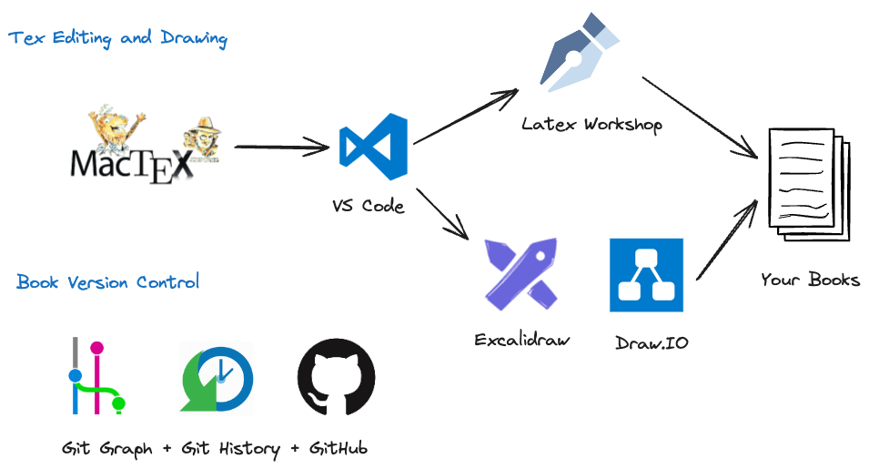

[Github](https://github.com/ElegantLaTeX/ElegantBook) | [CTAN](https://ctan.org/pkg/elegantbook) | [Download](https://github.com/ElegantLaTeX/ElegantBook/releases) | [Wiki](https://github.com/ElegantLaTeX/ElegantBook/wiki) 

   

-------

# ElegantBook: An Elegant LaTeX Template for Books

- [English Introduction](README-EN.md)
- [中文介绍](README-CN.md) 

## Quick Start

- MacOS 
  - Install MacTex: https://tug.org/mactex/ 
  - Install VS Code: https://code.visualstudio.com/ 
  - Install LaTex Workshop: https://marketplace.visualstudio.com/items?itemName=James-Yu.latex-workshop

- Windows or Linux 
  - Install Tex Live: https://www.tug.org/texlive/
 
Note: Demo PDF are generated by `xelatex` with MacTex 2023, VS Code + Latex Workshop. You can treat book writing like coding with the default git control and customized drawings. 
My favour VS Code drawing tools are
- Excalidraw: https://marketplace.visualstudio.com/items?itemName=pomdtr.excalidraw-editor 
- DrawIO: https://marketplace.visualstudio.com/items?itemName=hediet.vscode-drawio

CW/CP: Continuous Writing and Continuous Publishing

## File Structure

There are 6 directories, 27 files in total. The demo-elegantbook-cn/en.pdf are samples.

    .
    ├── License
    ├── README-CN.md
    ├── README-EN.md
    ├── README.md
    ├── chapters
    │   ├── cn
    │   │   ├── chapter-01-cn.tex
    │   │   ├── chapter-02-cn.tex
    │   │   ├── chapter-03-cn.tex
    │   │   ├── chapter-04-cn.tex
    │   │   ├── chapter-05-cn.tex
    │   │   ├── chapter-06-cn.tex
    │   │   └── chapter-A-cn.tex
    │   └── en
    │       ├── chapter-01-en.tex
    │       ├── chapter-02-en.tex
    │       ├── chapter-03-en.tex
    │       ├── chapter-04-en.tex
    │       ├── chapter-05-en.tex
    │       └── chapter-06-en.tex
    ├── demo-elegantbook-cn.pdf
    ├── demo-elegantbook-en.pdf
    ├── elegantbook-cn.tex
    ├── elegantbook-en.tex
    ├── elegantbook.cls
    ├── figure
    │   ├── cover.jpg
    │   └── logo-blue.png
    ├── image
    │   ├── founder.png
    │   └── scatter.jpg
    └── reference.bib

    6 directories, 27 files

## License

This work is released under the LaTeX Project Public License, v1.3c or later.
 
